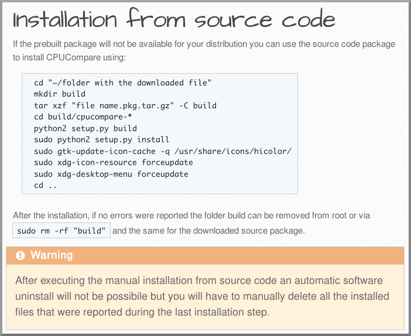
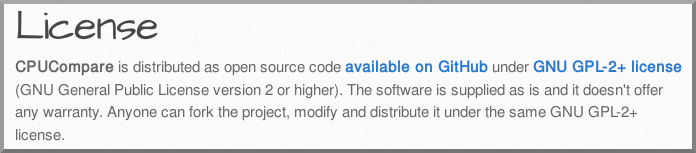

# Grav Shortcode Muflone Plugin

`shortcode-muflone` is a [Grav][grav] Plugin specific to the Grav Theme Muflone
to complete some of its features, mainly to add some page shortcuts.

# Installation

To install this plugin, just download the zip version of this repository and
unzip it under `/your/site/grav/user/plugins`.
Then, rename the folder to `shortcode-muflone`.

You should now have all the plugin files under

    /your/site/grav/user/plugins/shortcode-muflone

# Usage for content authors

## Shortcode for the Install snippet

To use this plugin insert in any page the following tag:

    [muflone-install type="index" package="cpucompare" name="CPUCompare"][/muflone-install]

    [muflone-install type="archlinux" package="" aurpackage="cpucompare" development="cpucompare-git"][/muflone-install]

    [muflone-install type="source" package="cpucompare" name="CPUCompare"][/muflone-install]

    [muflone-install type="debian" package="gnome-appfolders-manager"][/muflone-install]

## Shortcode for the License snippet

    [muflone-license type="index" package="cpucompare" name="CPUCompare"][/muflone-license]

## Shortcode for the Translations snippet

    [muflone-translations type="index" package="gnome-appfolders-manager" name="GNOME AppFolders Manager"]
    * English
    * Italian
    * French
    * German
    * Chinese
    * Swedish
    * Ukrainian
    
    [/muflone-translations]

[grav]: http://github.com/getgrav/grav
